# AWS Cloud Lakehouse ELT Pipeline

[](https://github.com/Revanthkumar517/aws-cloud-lakehouse-elt-pipeline/actions/workflows/project-checks.yml)

An end-to-end AWS data engineering pipeline that generates e-commerce data, validates it, stores raw files in Amazon S3, transforms the data into partitioned Parquet using AWS Glue PySpark, catalogs the datasets with AWS Glue Crawlers, queries the lakehouse through Amazon Athena, builds analytics models with dbt, and orchestrates the complete workflow using Apache Airflow.

The cloud infrastructure is provisioned with Terraform. Data quality is validated using Great Expectations, dbt tests, Athena validation queries, and GitHub Actions.

---

## Architecture

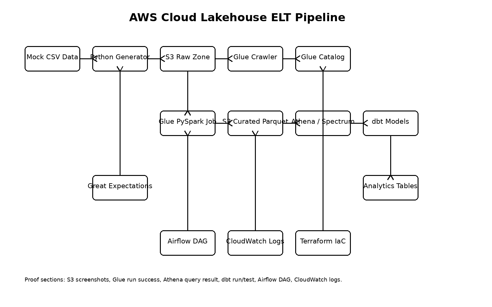

### End-to-End Pipeline Flow

```text
Python Mock Data Generator
        ↓
Great Expectations Validation
        ↓
Amazon S3 Raw Zone
        ↓
AWS Glue Raw Crawler
        ↓
AWS Glue Data Catalog
        ↓
AWS Glue PySpark Transformation
        ↓
Amazon S3 Curated Zone
Partitioned Parquet Files
        ↓
AWS Glue Curated Crawler
        ↓
Amazon Athena
        ↓
dbt Staging Models
        ↓
dbt Dimensions and Fact Table
        ↓
Athena Business and Quality Validation
```

Apache Airflow controls the execution order of the complete pipeline.

---

## Project Objectives

This project implements a cloud lakehouse pipeline with the following objectives:

* Generate repeatable mock e-commerce datasets.
* Validate raw data before cloud ingestion.
* Store source data in an Amazon S3 raw zone.
* Transform CSV files into optimized Parquet datasets.
* Partition order data by order status.
* Register raw and curated datasets in the AWS Glue Data Catalog.
* Query the curated lakehouse through Amazon Athena.
* Build staging, dimension, and fact models using dbt.
* Validate row counts, uniqueness, null values, and business metrics.
* Orchestrate the full pipeline with Apache Airflow.
* Provision and remove AWS infrastructure using Terraform.
* Validate Python and Terraform code through GitHub Actions.

---

## Technology Stack

| Layer                   | Technology                                       |
| ----------------------- | ------------------------------------------------ |
| Programming             | Python, SQL, PySpark                             |
| Cloud Storage           | Amazon S3                                        |
| Data Catalog            | AWS Glue Data Catalog                            |
| Metadata Discovery      | AWS Glue Crawlers                                |
| Distributed Processing  | AWS Glue PySpark                                 |
| Serverless Query Engine | Amazon Athena                                    |
| Analytics Engineering   | dbt Core, dbt-athena-community                   |
| Workflow Orchestration  | Apache Airflow                                   |
| Data Quality            | Great Expectations, dbt tests, Athena validation |
| Infrastructure as Code  | Terraform                                        |
| Local Containers        | Docker Desktop, Docker Compose                   |
| CI Validation           | GitHub Actions                                   |
| Version Control         | Git, GitHub                                      |

---

## Dataset

The pipeline generates three e-commerce datasets.

### Customers

Contains customer details such as:

* `customer_id`
* `first_name`
* `last_name`
* `email`
* `state`
* `signup_date`

Generated row count:

```text
500 customers
```

### Products

Contains product information such as:

* `product_id`
* `product_name`
* `category`
* `unit_price`

Generated row count:

```text
100 products
```

### Orders

Contains transaction information such as:

* `order_id`
* `customer_id`
* `product_id`
* `order_date`
* `quantity`
* `unit_price`
* `order_amount`
* `order_status`

Generated row count:

```text
3,000 orders
```

Order status values include:

```text
completed
pending
cancelled
returned
```

---

## Data Lakehouse Layers

### Raw Zone

The generated CSV files are uploaded to:

```text
s3://<bucket-name>/raw/ecommerce/customers/
s3://<bucket-name>/raw/ecommerce/products/
s3://<bucket-name>/raw/ecommerce/orders/
```

The raw zone preserves source-format data before transformation.

### Curated Zone

AWS Glue PySpark reads the raw CSV files, applies data-type conversions and calculated columns, and writes compressed Parquet files to:

```text
s3://<bucket-name>/curated/ecommerce/customers/
s3://<bucket-name>/curated/ecommerce/products/
s3://<bucket-name>/curated/ecommerce/orders/
```

Orders are partitioned using Hive-style folders:

```text
order_status=completed/
order_status=pending/
order_status=cancelled/
order_status=returned/
```

Using Parquet and partitioning reduces Athena data scanning compared with repeatedly querying raw CSV files.

---

## AWS Glue Transformation

The AWS Glue PySpark job performs the following operations:

1. Reads customers, products, and orders from the S3 raw zone.
2. Applies explicit data types.
3. Removes duplicate records.
4. Handles required-column validation.
5. Calculates order-level metrics.
6. Adds ingestion metadata.
7. Writes customers and products as Parquet.
8. Writes orders as Parquet partitioned by `order_status`.

Glue Crawlers register both raw and curated datasets in the Glue Data Catalog.

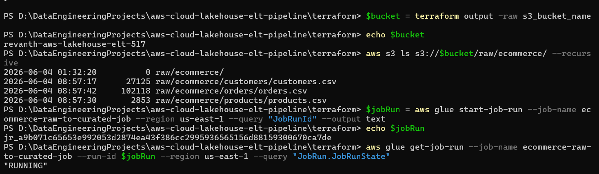

### Curated S3 Output

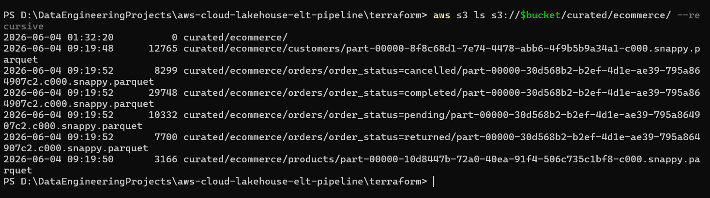

### Orders Partitioned by Status

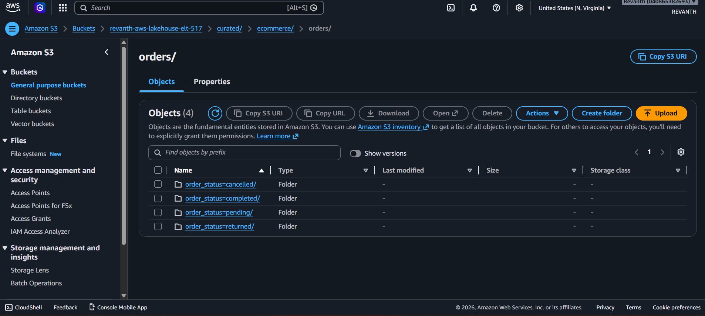

---

## Amazon Athena Analytics

Athena queries the curated Parquet datasets through the AWS Glue Data Catalog.

Implemented queries include:

* Row-count validation
* Revenue by order status
* Revenue by product category
* Revenue by customer state
* Final fact-table validation
* Null-key validation
* Positive completed-revenue validation

### Curated Row Counts

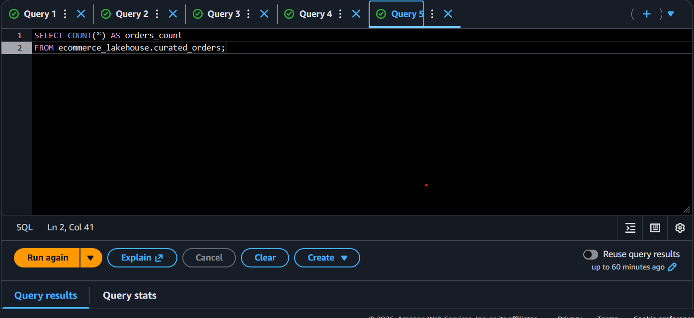

### Revenue by Order Status

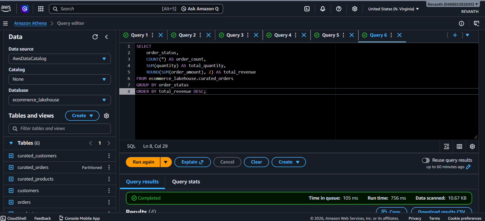

### Revenue by Product Category

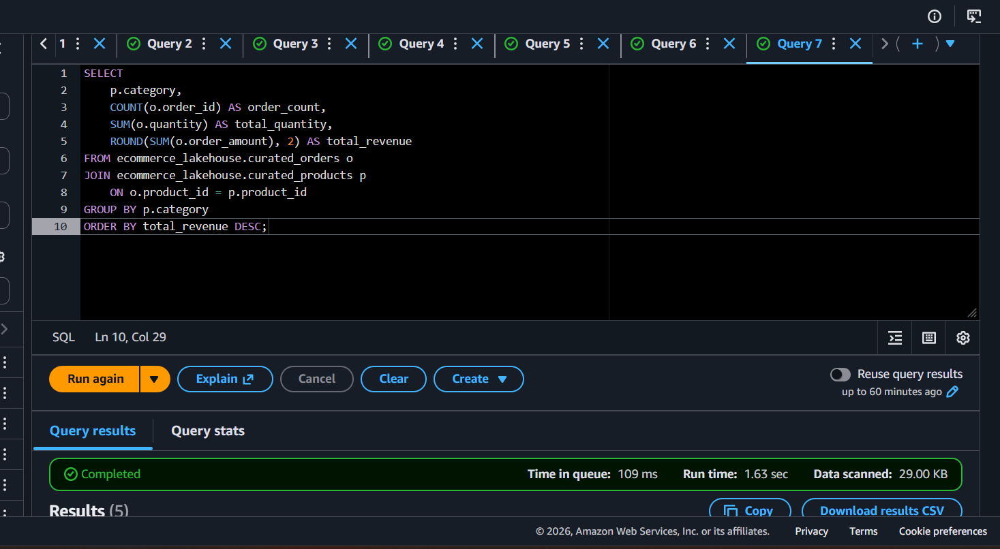

### Revenue by Customer State

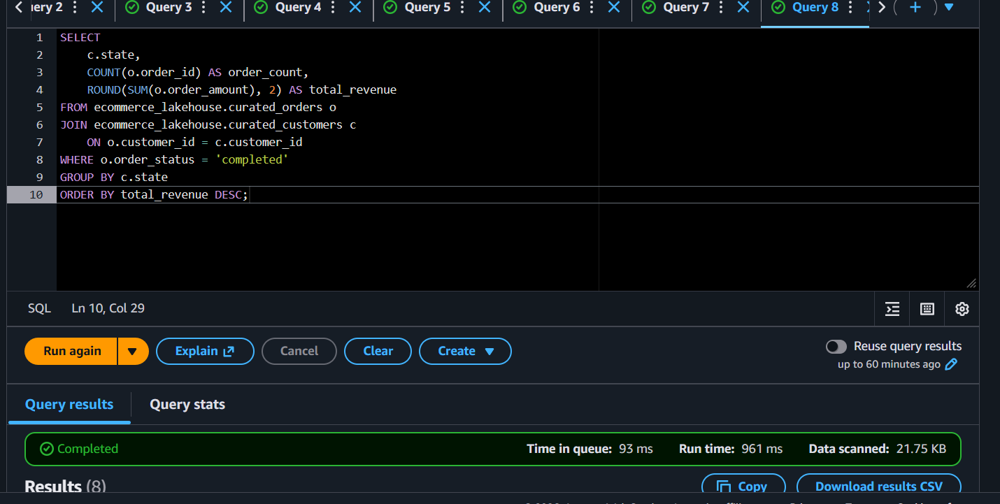

---

## dbt Analytics Models

dbt transforms the curated Athena tables into analytics-ready models.

### Staging Models

```text
stg_customers
stg_products
stg_orders
```

The staging layer standardizes:

* Column names
* Data types
* Date fields
* Numeric fields
* Status values
* Source-to-model references

### Dimension Models

```text
dim_customers
dim_products
```

The dimension models provide reusable customer and product attributes.

### Fact Model

```text
fct_orders
```

The fact model combines:

* Order transactions
* Customer attributes
* Product attributes
* Order amount
* Order quantity
* Order status
* Completed-revenue calculation

### Model Relationships

```text
curated_customers
        ↓
stg_customers
        ↓
dim_customers
        ┐
        │
        ├──→ fct_orders
        │
curated_products
        ↓
stg_products
        ↓
dim_products
        ┘

curated_orders
        ↓
stg_orders
        ↓
fct_orders
```

### dbt Run

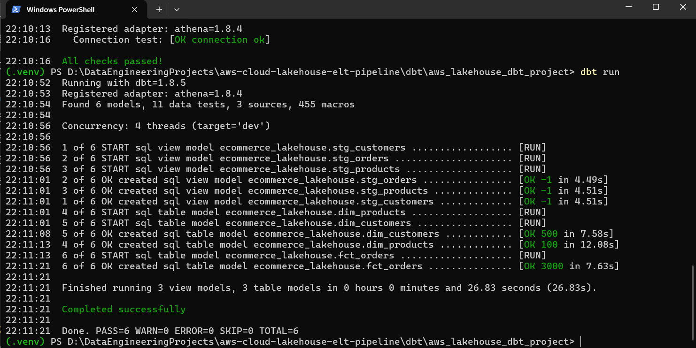

### dbt Tests

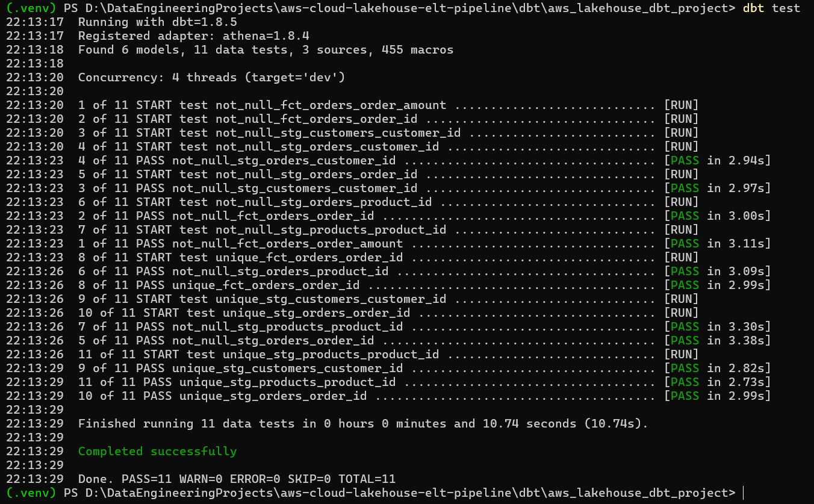

### dbt Lineage

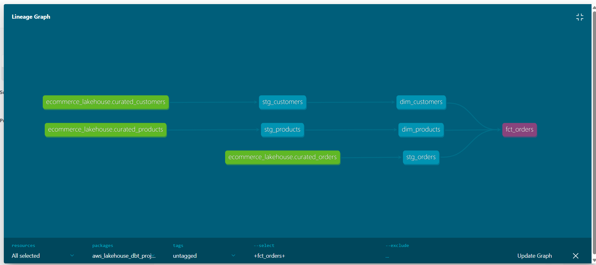

---

## Data Quality Validation

The project validates data at multiple pipeline stages.

### Great Expectations Checks

Raw orders are checked for:

* Non-null `order_id`
* Unique `order_id`
* Non-null `customer_id`
* Non-null `product_id`
* Valid quantity range
* Accepted order-status values

### dbt Tests

dbt validates:

* Unique primary keys
* Non-null primary keys
* Valid relationships
* Required fact-table fields
* Expected model structure

### Athena Validation

The final validation script checks:

```text
fct_orders row count = 3000
null order IDs = 0
dim_customers row count = 500
dim_products row count = 100
completed revenue > 0
```

The Airflow pipeline fails when a required validation does not pass.

---

## Airflow Orchestration

Apache Airflow orchestrates the complete pipeline through the following DAG:

```text
aws_cloud_lakehouse_elt_pipeline
```

### DAG Task Flow

```text
generate_mock_data
    ↓
validate_raw_data
    ↓
upload_raw_files_to_s3
    ↓
run_raw_crawler
    ↓
run_glue_transform_job
    ↓
run_curated_crawler
    ↓
run_dbt_models_and_tests
    ↓
run_athena_validation_queries
```

The DAG:

* Generates source data.
* Validates raw records.
* Uploads files to S3.
* Runs the raw Glue Crawler.
* Starts and monitors the Glue PySpark job.
* Runs the curated Glue Crawler.
* Executes dbt models and tests.
* Runs final Athena validation queries.

### Airflow Dashboard

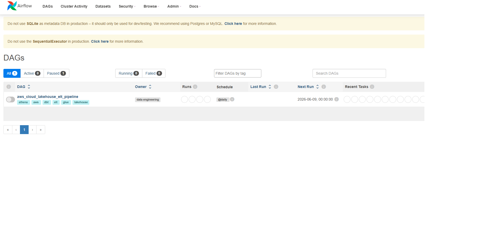

### Airflow DAG

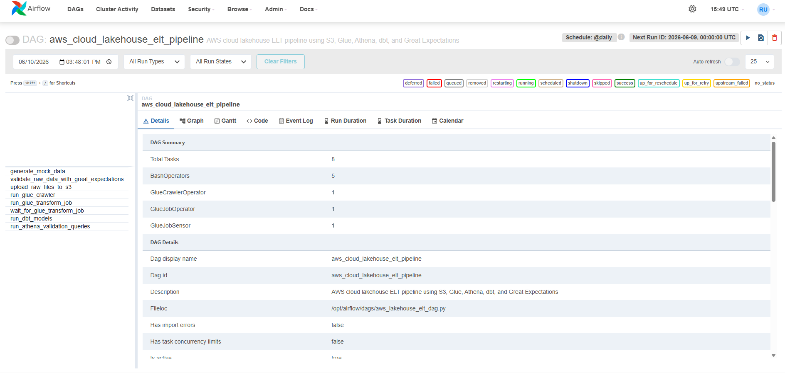

### Airflow Task Tree

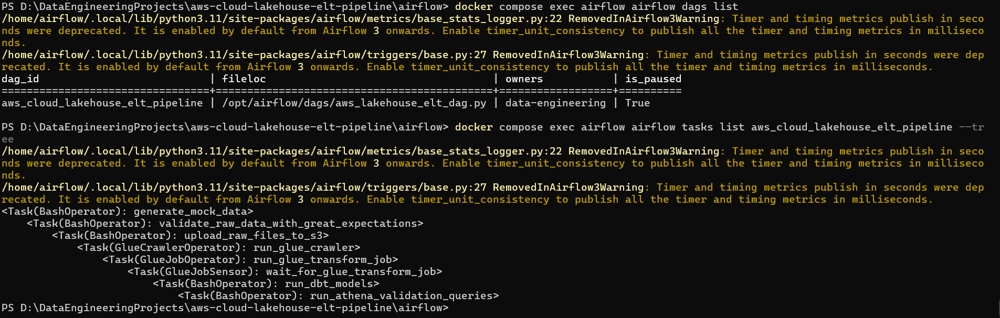

### Successful End-to-End Run

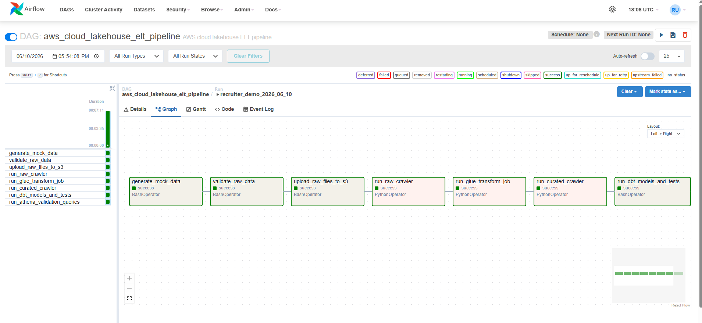

### DAG Run Details

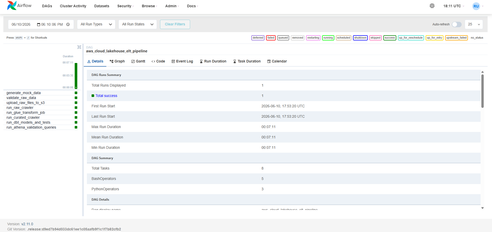

### Task Duration

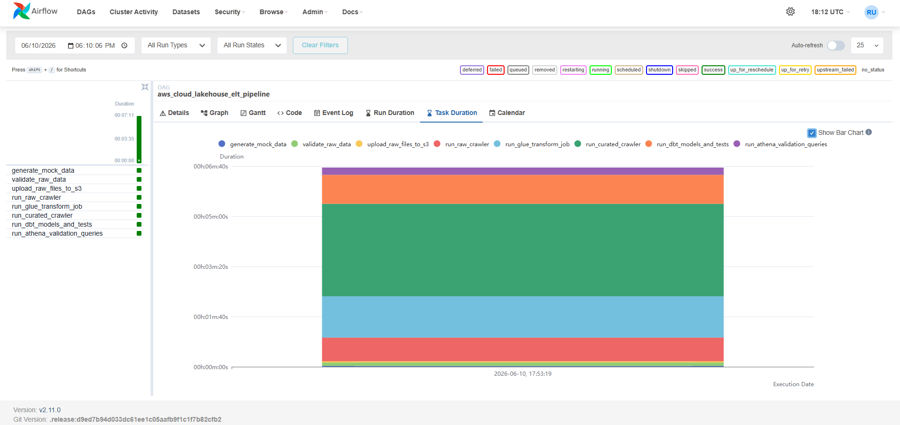

---

## Infrastructure as Code

Terraform provisions the AWS infrastructure required by the pipeline.

Managed resources include:

* Amazon S3 lakehouse bucket
* AWS Glue database
* AWS Glue raw crawler
* AWS Glue PySpark job
* IAM role and policies for Glue
* Amazon Athena workgroup
* Athena query-result configuration

Terraform files are stored under:

```text
terraform/
```

Key files include:

```text
providers.tf
variables.tf
main.tf
iam.tf
glue.tf
athena.tf
outputs.tf
terraform.tfvars.example
```

Sensitive Terraform state and local variable files are excluded from Git.

### Terraform Deployment

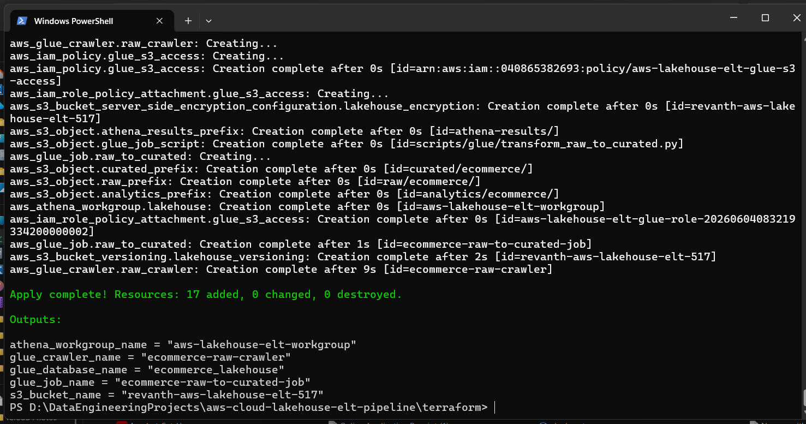

### Terraform Resource Cleanup

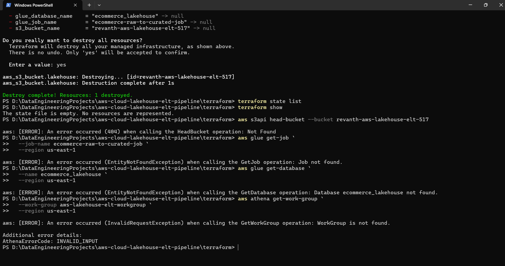

---

## GitHub Actions CI

The GitHub Actions workflow runs on pushes and pull requests to the `main` branch.

The workflow contains two jobs.

### Python Validation

The Python job:

1. Installs pinned Python dependencies.
2. Generates mock e-commerce data.
3. Runs Great Expectations validation.

### Terraform Validation

The Terraform job:

1. Checks Terraform formatting.
2. Initializes Terraform without a remote backend.
3. Validates the Terraform configuration.

Workflow file:

```text
.github/workflows/project-checks.yml
```

### Successful CI Run

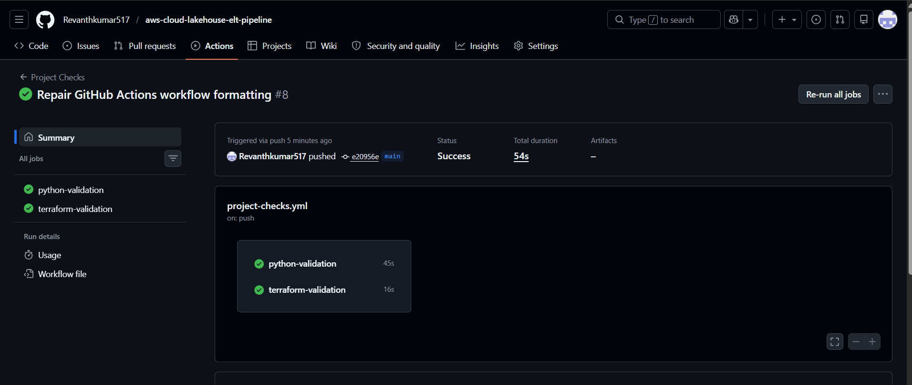

---

## Project Structure

```text
aws-cloud-lakehouse-elt-pipeline/
│
├── .github/
│   └── workflows/
│       └── project-checks.yml
│
├── airflow/
│   ├── dags/
│   │   └── aws_lakehouse_elt_dag.py
│   ├── Dockerfile
│   ├── docker-compose.yml
│   └── .env.example
│
├── data/
│   └── README.md
│
├── data_generator/
│   └── generate_mock_data.py
│
├── dbt/
│   ├── profiles.yml.example
│   └── aws_lakehouse_dbt_project/
│       ├── dbt_project.yml
│       └── models/
│           ├── staging/
│           │   ├── stg_customers.sql
│           │   ├── stg_products.sql
│           │   └── stg_orders.sql
│           ├── marts/
│           │   ├── dim_customers.sql
│           │   ├── dim_products.sql
│           │   └── fct_orders.sql
│           └── schema.yml
│
├── docs/
│   ├── architecture.md
│   ├── architecture_diagram.png
│   ├── data_quality_rules.md
│   ├── deployment_runbook.md
│   └── screenshots/
│
├── glue/
│   └── jobs/
│       └── transform_raw_to_curated.py
│
├── quality/
│   └── validate_raw_orders.py
│
├── scripts/
│   ├── upload_to_s3.py
│   └── run_athena_validation.py
│
├── sql/
│   ├── athena_create_external_tables.sql
│   └── athena_validation_queries.sql
│
├── terraform/
│   ├── providers.tf
│   ├── variables.tf
│   ├── main.tf
│   ├── iam.tf
│   ├── glue.tf
│   ├── athena.tf
│   ├── outputs.tf
│   └── terraform.tfvars.example
│
├── phase1_lakehouse_local_validation.ipynb
├── requirements.txt
├── Makefile
├── .env.example
├── .gitignore
└── README.md
```

---

## Prerequisites

Install the following tools before running the project:

* Python 3.10 or 3.11
* Git
* AWS CLI
* Terraform
* Docker Desktop
* Docker Compose
* An AWS account
* AWS credentials with permission to use S3, Glue, IAM, and Athena

Verify the installations:

```powershell
python --version
git --version
aws --version
terraform -version
docker --version
docker compose version
```

---

## Local Python Setup

Clone the repository:

```powershell
git clone https://github.com/Revanthkumar517/aws-cloud-lakehouse-elt-pipeline.git
```

Enter the project:

```powershell
cd aws-cloud-lakehouse-elt-pipeline
```

Create a virtual environment:

```powershell
python -m venv .venv
```

If PowerShell blocks activation, allow scripts for the current session:

```powershell
Set-ExecutionPolicy -Scope Process -ExecutionPolicy Bypass
```

Activate the environment:

```powershell
.\.venv\Scripts\activate
```

Install dependencies:

```powershell
python -m pip install --upgrade pip
python -m pip install -r requirements.txt
```

---

## Generate and Validate Data Locally

Generate the source datasets:

```powershell
python data_generator/generate_mock_data.py
```

Expected files:

```text
data/raw/customers.csv
data/raw/products.csv
data/raw/orders.csv
```

Run raw-data validation:

```powershell
python quality/validate_raw_orders.py
```

Expected output:

```text
Great Expectations validation passed for raw orders.
```

---

## AWS Configuration

Configure the AWS CLI:

```powershell
aws configure
```

Provide:

```text
AWS Access Key ID
AWS Secret Access Key
Default region: us-east-1
Default output format: json
```

Verify the connection:

```powershell
aws sts get-caller-identity
```

Do not commit AWS credentials to the repository.

---

## Terraform Deployment

Go to the Terraform directory:

```powershell
cd terraform
```

Create the local variables file:

```powershell
Copy-Item terraform.tfvars.example terraform.tfvars
```

Update `terraform.tfvars` with a globally unique S3 bucket name.

Example:

```hcl
aws_region      = "us-east-1"
project_name    = "aws-lakehouse-elt"
s3_bucket_name  = "your-unique-s3-bucket-name"
athena_database = "ecommerce_lakehouse"
```

Initialize Terraform:

```powershell
terraform init
```

Validate the configuration:

```powershell
terraform fmt
terraform validate
```

Review the deployment plan:

```powershell
terraform plan
```

Create the resources:

```powershell
terraform apply
```

Enter:

```text
yes
```

when Terraform requests confirmation.

---

## dbt Configuration

Copy the example dbt profile:

```powershell
Copy-Item dbt\profiles.yml.example "$env:USERPROFILE\.dbt\profiles.yml"
```

Update the profile with:

* AWS region
* Athena workgroup
* Glue database
* S3 Athena results path
* S3 dbt analytics path

Go to the dbt project:

```powershell
cd dbt\aws_lakehouse_dbt_project
```

Validate the connection:

```powershell
dbt debug
```

Run the models:

```powershell
dbt run --full-refresh
```

Run the tests:

```powershell
dbt test
```

Generate documentation:

```powershell
dbt docs generate
dbt docs serve
```

---

## Airflow Setup

Go to the Airflow directory:

```powershell
cd airflow
```

Copy the environment template:

```powershell
Copy-Item .env.example .env
```

Update `.env` with:

```text
AIRFLOW_FERNET_KEY=<generated-fernet-key>
S3_BUCKET=<your-unique-s3-bucket-name>
```

Generate a Fernet key with:

```powershell
python -c "from cryptography.fernet import Fernet; print(Fernet.generate_key().decode())"
```

Build the Airflow Docker image:

```powershell
docker compose build
```

Start Airflow:

```powershell
docker compose up -d
```

Check container status:

```powershell
docker compose ps
```

Open Airflow:

```text
http://localhost:8080
```

Default local credentials:

```text
Username: admin
Password: admin
```

Stop Airflow:

```powershell
docker compose down
```

---

## Run the End-to-End Pipeline

After Airflow is running:

1. Open the Airflow dashboard.
2. Locate `aws_cloud_lakehouse_elt_pipeline`.
3. Unpause the DAG.
4. Trigger one manual run.
5. Monitor the Grid or Graph view.
6. Confirm that all tasks finish successfully.

The final DAG run should show all tasks in the success state.

---

## Resource Cleanup

Cloud resources should be removed after testing to prevent unnecessary charges.

Delete any manually created Glue resources that are not managed by Terraform.

Empty all current S3 objects:

```powershell
aws s3 rm s3://<bucket-name>/ --recursive
```

If the bucket contains object versions or delete markers, remove them before destroying the bucket.

Delete the Athena workgroup recursively if it contains query history:

```powershell
aws athena delete-work-group `
  --work-group aws-lakehouse-elt-workgroup `
  --recursive-delete-option `
  --region us-east-1
```

Destroy Terraform-managed infrastructure:

```powershell
cd terraform
terraform destroy
```

Enter:

```text
yes
```

when requested.

Verify that the Terraform state is empty:

```powershell
terraform state list
```

---

## Security Practices

The repository excludes:

* AWS credentials
* Airflow `.env`
* Terraform state
* Terraform variable values
* Python virtual environments
* Airflow databases and logs
* dbt generated artifacts
* Locally generated raw data

The following files are provided only as safe configuration templates:

```text
.env.example
airflow/.env.example
terraform/terraform.tfvars.example
dbt/profiles.yml.example
```

Never commit actual credentials, secret keys, Fernet keys, or Terraform state files.

---

## Implementation Results

The completed pipeline demonstrated:

* Generation of 500 customer records
* Generation of 100 product records
* Generation of 3,000 order records
* Raw CSV ingestion into Amazon S3
* Glue Data Catalog registration
* PySpark transformation into Parquet
* Order partitioning by status
* Athena SQL analytics
* dbt staging, dimension, and fact models
* Great Expectations validation
* dbt data tests
* Airflow end-to-end orchestration
* Terraform deployment and teardown
* GitHub Actions validation for Python and Terraform
* Secure handling of local configuration and cloud credentials
